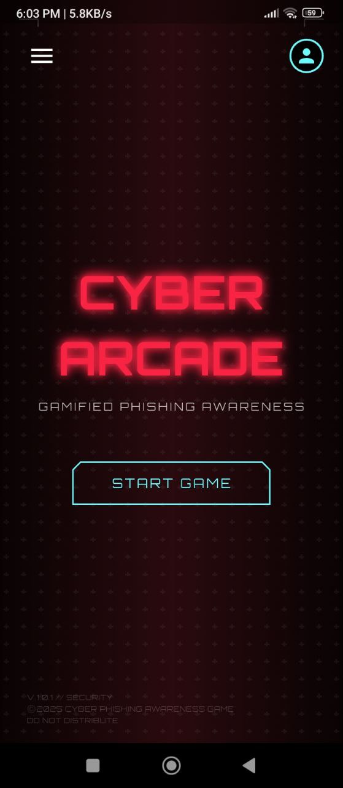
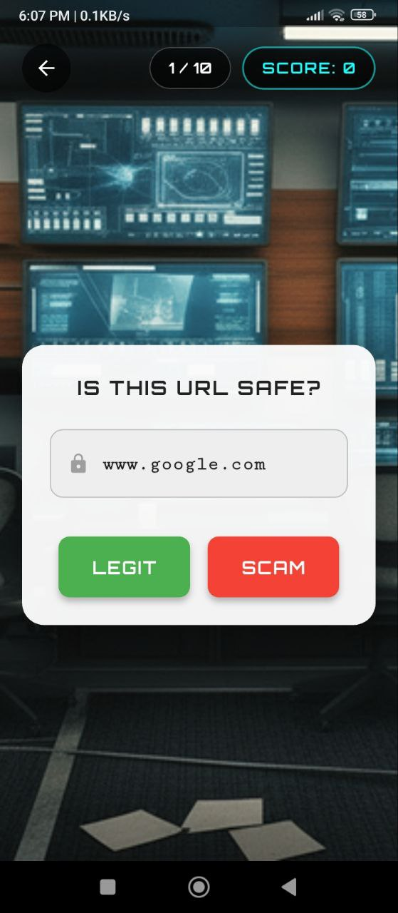

# 🕹️ CYBER ARCADE

**A Gamified Phishing & Social Engineering Defense Simulator**

<p align="center">
  
</p>

> **Cyber Arcade** is a Flutter-based cybersecurity training platform that teaches users to recognize and respond to modern social engineering attacks through interactive, narrative-driven missions.

---

## ✨ Core Features

* 🔐 **Secure Authentication:** Complete Auth flow via Firebase (Email/Password & Google Sign-In)
* 🎮 **Progressive Training:** 8 dynamic levels encompassing URL analysis, Vishing, Quishing (QR), and misinformation defense
* 📈 **Cloud Progression:** Persistent XP tracking, high scores, and level unlocks powered by Firestore
* 🤖 **AI Phishing Consultant:** An integrated Gemini-powered assistant for real-time security advice and VirusTotal-backed URL threat analysis
* 🔊 **Immersive Audio:** Continuous cyberpunk background music and interactive SFX (with global mute controls)
* 🎨 **Custom UI/UX:** A bespoke, retro-futuristic Cyberpunk aesthetic utilizing custom `Orbitron` typography and glassmorphism elements

---

## 📸 Interface Showcase

<table>
  <tr>
    <td align="center">
      
      <br/>
      <em>Main Dashboard</em>
    </td>
    <td align="center">
      
      <br/>
      <em>Story Cutscene</em>
    </td>
    <td align="center">
      
      <br/>
      <em>Level 1: Domain Phishing</em>
    </td>
  </tr>
</table>

---

## 📂 Project Architecture

```
lib/
├── data/                  # Static level datasets and cutscene scripts
├── screens/
│   ├── Auth_Page/         # Firebase authentication flow
│   ├── Game_Level/        # Level rendering and mission UI
│   ├── Home_Page/         # Main dashboard and progression overview
│   ├── Phishing_Consultant/ # Gemini AI Chat interface
│   └── Settings/          # Audio and system preferences
├── services/              # Singleton services (Audio, Auth, Firestore)
├── widgets/               # Reusable cyberpunk-themed UI components
└── main.dart              # App bootstrap and route definitions
```

---

## 🚀 Setup & Installation

### Prerequisites

1. **Flutter SDK** installed and added to PATH
2. A configured **Firebase Project**
3. Active API keys for **Google Gemini** and **VirusTotal**

### 1. Clone the Repository

```bash
git clone <your-repo-url>
cd Cyber_Arcade
flutter pub get
```

### 2. Configure Environment Variables

Create a `lib/const.dart` file (this file is git-ignored for security) and add your API credentials:

```dart
const String GEMINI_API_KEY = 'YOUR_GEMINI_API_KEY';
const String VIRUSTOTAL_API_KEY = 'YOUR_VIRUSTOTAL_API_KEY';
```

⚠️ *The app will not compile without this configuration file.*

### 3. Initialize Firebase

Ensure you have the FlutterFire CLI installed, then configure your target platforms:

```bash
flutterfire configure
```

### 4. Deploy

```bash
flutter run
```

---

## 🎯 Mission Briefings (Game Levels)

Users must earn XP to unlock subsequent training modules:

| Level | Designation | Threat Vector |
| :---: | :--- | :--- |
| **01** | Rookie | Basic URL Detection |
| **02** | Expert | Social Engineering |
| **03** | Master | Vishing (Voice Phishing) Defense |
| **04** | Shadow Wi-Fi | Network Security & Rogue APs |
| **05** | Quishing | Malicious QR Code Forensics |
| **06** | Follow the Money | Secure Payment Routing |
| **07** | Gatekeeper | Malware App Analysis |
| **08** | The Echo Room | Misinformation & Digital Literacy |

---

## 🛠️ Troubleshooting

* **Build fails on missing constants:** Double-check that `lib/const.dart` is formatted exactly as shown in the setup instructions
* **Firebase Connection Issues:** Ensure `google-services.json` (Android) or `GoogleService-Info.plist` (iOS) are placed in their respective native directories
* **Audio Focus Issues:** Ensure you are testing on a physical device or a simulator with hardware audio enabled

---

## 🤝 Contributing

1. Fork the Project
2. Create your Feature Branch (`git checkout -b feature/AmazingFeature`)
3. Commit your Changes (`git commit -m 'feat: Add some AmazingFeature'`)
4. Push to the Branch (`git push origin feature/AmazingFeature`)
5. Open a Pull Request

---

## 📜 License

This project is part of an academic research initiative on cybersecurity education.

---

<p align="center">
  <em>"Stay vigilant, stay secure." — ARC COMMAND</em>
</p>